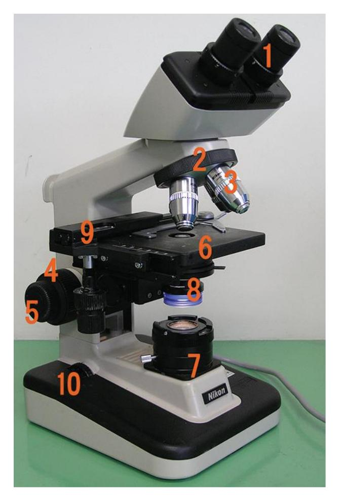
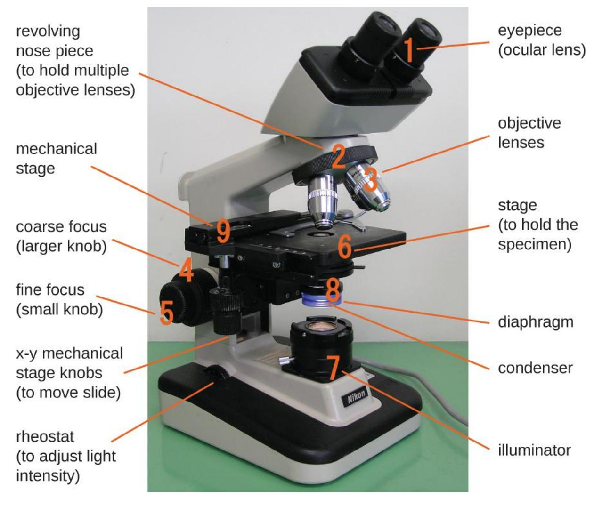
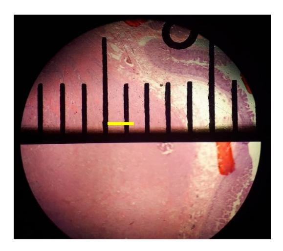

# Chapter 2: Use of the Microscope

## Prelab Activity 2.1 — Parts of the Microscope

| Number | Completed Answer |
|---:|---|
| 1 | Ocular lens / eyepiece |
| 2 | Revolving nosepiece / turret |
| 3 | Objective lens |
| 4 | Coarse focus knob |
| 5 | Fine focus knob |
| 6 | Mechanical stage |
| 7 | Light source / illuminator |
| 8 | Condenser / iris diaphragm area |
| 9 | Arm |
| 10 | Base |

## Prelab Activity 2.2 — Matching

| Microscope Part | Answer Letter | Definition |
|---|---:|---|
| Condenser | j | Set of lenses that collect and focus the light onto the specimen. |
| Revolving turret | g | Also known as the nosepiece; holds the objective lenses. |
| Mechanical stage | q | The section in which the specimen is placed for viewing. |
| Ocular lens | e | The lens closest to the eye. |
| Power switch | p | The switch used to turn the microscope on and off. |
| Iris diaphragm | k | Controls the amount of light reaching the specimen. |
| Arm | d | The part connecting the head and the base. |
| Depth of field | o | The measure of the thickness of the specimen in focus. |
| Fine focus | i | The knob that makes small adjustments in focus. |
| X-Y stage controls | l | Controls that move the slide vertically and horizontally on the stage. |
| Light source | a | The light source in the bottom of the microscope, also known as the illuminator. |
| Total magnification | m | Calculated by multiplying the ocular magnification by the objective magnification. |
| Head | b | Also known as the body; carries the oculars. |
| Base | c | The microscope support. |
| Objective lens | f | The major lenses closest to the specimen. |
| Coarse focus | h | Knob that makes large-scale adjustments in focus. |
| Field of view | n | The visible area one can see through the oculars. |

## Lab Activity 2.1 — Labeled Microscope Key

| Number | Completed Answer |
|---:|---|
| 1 | Ocular lens |
| 2 | Head |
| 3 | Revolving nosepiece / turret |
| 4 | Objective lens |
| 5 | Arm |
| 6 | Mechanical stage |
| 7 | Stage clips |
| 8 | Diaphragm |
| 9 | Condenser |
| 10 | Fine focus |
| 11 | Coarse focus |
| 12 | X-Y mechanical stage knobs |
| 13 | Light source / illuminator |
| 14 | Rheostat |
| 15 | Illuminator switch |

## Lab Activity 2.1 — Magnification Table

| Lenses | Ocular Lens | Objective Lens | Total Magnification |
|---|---:|---:|---:|
| Scanning, red lines | 10x | 4x | 40x |
| Low power dry, blue lines | 10x | 10x | 100x |
| High power dry, yellow lines | 10x | 40x | 400x |
| Oil immersion, black/white lines | 10x | 100x | 1000x |

## Measuring and Calculating the Field of View

| Question / Task | Completed Answer |
|---|---|
| What happens to the field of view as magnification increases? | The field of view decreases as magnification increases. |
| What happens to the amount of detail as magnification increases? | Detail increases, but the visible area becomes smaller. |
| Why do you center the specimen before increasing power? | The field of view becomes smaller at higher power, so an off-center specimen may disappear. |
| If the ocular lens is 10x and the scanning objective is 4x, what is total magnification? | 40x. |
| If the ocular lens is 10x and the low-power objective is 10x, what is total magnification? | 100x. |
| If the ocular lens is 10x and the high-power objective is 40x, what is total magnification? | 400x. |
| If the ocular lens is 10x and the oil immersion objective is 100x, what is total magnification? | 1000x. |

## Focusing Exercises — Expected Answers

| Question | Completed Answer |
|---|---|
| Under the scanning lens, is the whole thickness of the crossed threads easier to see? | Yes. The scanning lens has a greater depth of field, so more thickness is in focus. |
| Under 100x, do you move the adjustment knob more or less than with scanning power? | Less. At higher magnification, only small fine-focus adjustments should be used. |
| Under 400x, is the entire thickness of the thread in focus? | No. Only a thinner layer is in focus. |
| What does this show about depth of field at high power? | Depth of field decreases as magnification increases. |
| Which focus knob should you use on high power? | Fine focus only. |

## End-of-Lab Microscope Care

| Step | Completed Action |
|---:|---|
| 1 | Remove the slide and return it to the correct tray. |
| 2 | Turn off and unplug the microscope. |
| 3 | Wrap the cord correctly. |
| 4 | Rotate the scanning objective into place. |
| 5 | Lower the stage. |
| 6 | Clean lenses only with lens paper. |
| 7 | Replace the dust cover. |
| 8 | Carry the microscope with two hands. |
