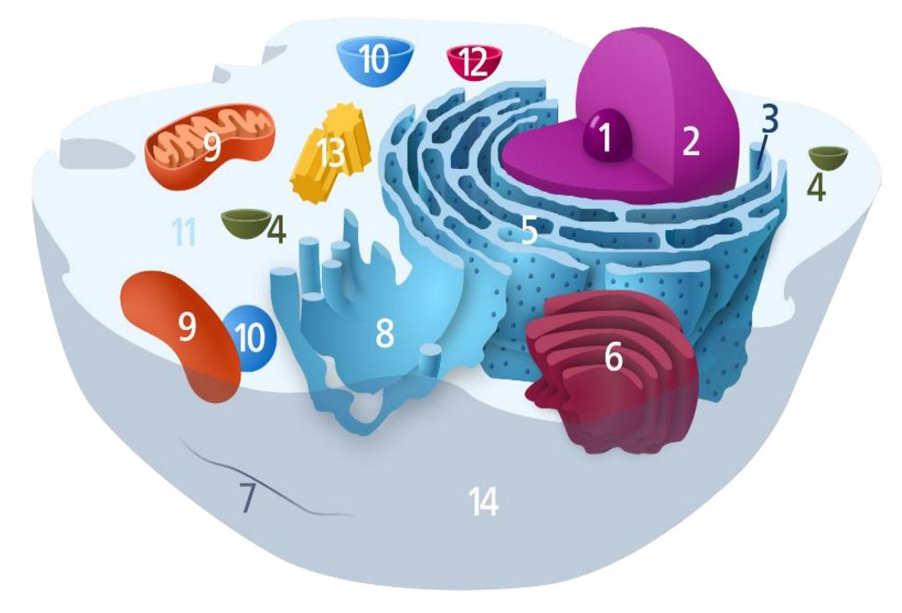
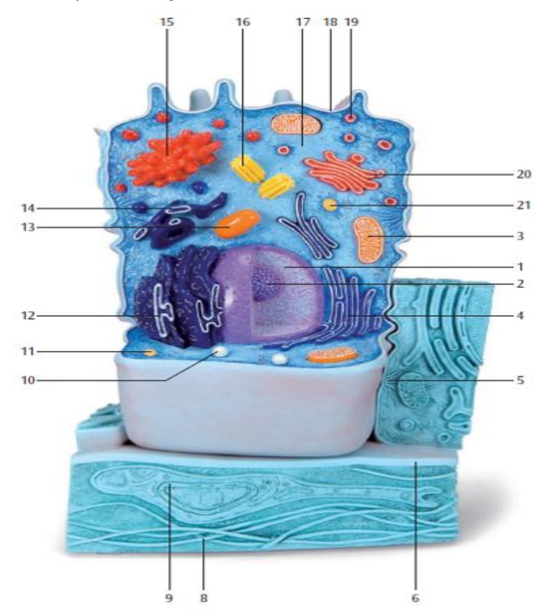
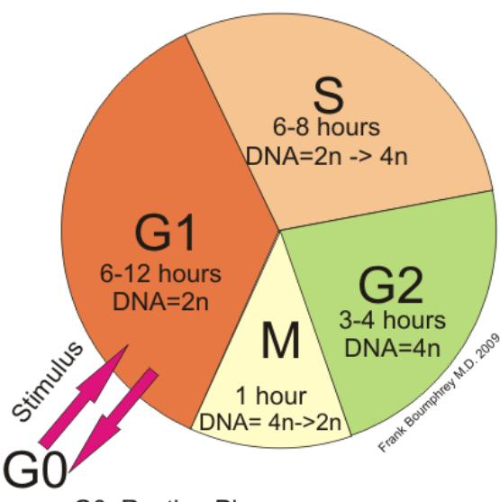
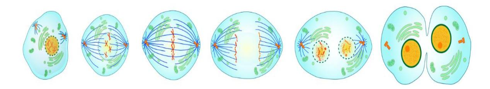
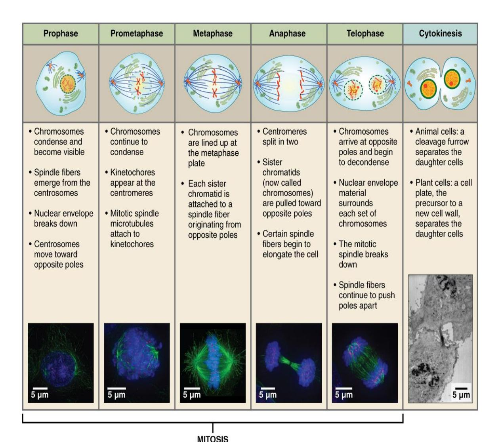
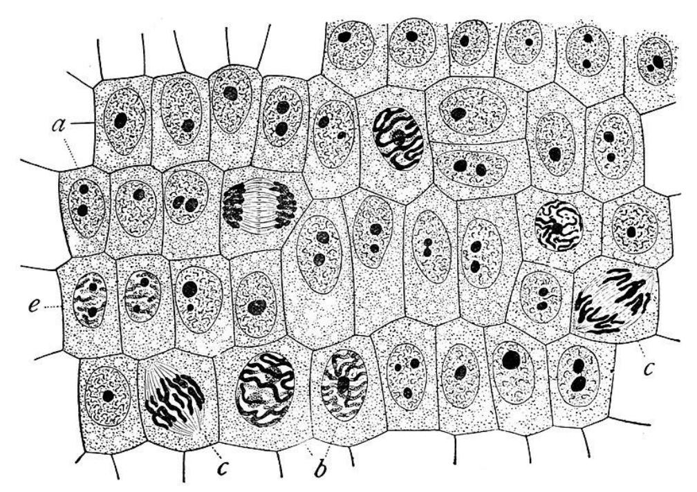

# Chapter 3: Cells

## Prelab Activity 3.1 — Cell Structure and Function

| Term | Completed Definition |
|---|---|
| Cytoplasm | All material inside the cell membrane except the nucleus; includes cytosol and organelles. |
| Cytosol | The fluid portion of the cytoplasm. |
| Organelles | Specialized cell structures that perform specific functions. |
| Rough endoplasmic reticulum | Membrane network with ribosomes; helps make and fold proteins. |
| Smooth endoplasmic reticulum | Membrane network without ribosomes; makes lipids and helps detoxify substances. |
| Golgi apparatus | Modifies, sorts, and packages proteins and lipids for transport or secretion. |
| Mitochondrion | Produces ATP energy through cellular respiration. |
| Lysosomes | Digest worn-out organelles, debris, and large molecules. |
| Peroxisomes | Break down fatty acids and detoxify hydrogen peroxide. |
| Microfilaments | Thin cytoskeletal fibers that support shape and movement. |
| Microtubules | Larger cytoskeletal tubes that help with cell shape, transport, cilia, flagella, and spindle formation. |
| Cilia | Short hairlike structures that move materials across the cell surface. |
| Flagella | Long whiplike structure used for cell movement. |
| Nucleus | Contains DNA and controls cell activities. |
| Nucleolus | Produces ribosomal subunits inside the nucleus. |

## Membrane Transport and Cell Cycle Terms

| Term | Completed Answer |
|---|---|
| Passive transport | Movement across the membrane without using cellular energy. |
| Active transport | Movement across the membrane that requires cellular energy, usually ATP. |
| Diffusion | Movement of molecules from high concentration to low concentration. |
| Osmosis | Diffusion of water across a selectively permeable membrane. |
| Cell cycle | The life cycle of a cell from formation to division. |
| Interphase | Stage when the cell grows, performs normal functions, and copies DNA. |
| Mitosis | Division of the nucleus into two identical nuclei. |
| G1 phase | Cell grows and carries out normal functions. |
| S phase | DNA is synthesized / replicated. |
| G2 phase | Cell prepares for mitosis and checks DNA. |

## Prelab Activity 3.2 — Stages of Mitosis

| Stage | Events | Appearance of Cell |
|---|---|---|
| Prophase | Chromatin condenses into chromosomes; nuclear envelope begins to break down; spindle forms. | Chromosomes become visible and darker. |
| Metaphase | Chromosomes line up at the middle of the cell. | Chromosomes are aligned across the center. |
| Anaphase | Sister chromatids separate and move toward opposite poles. | Chromosomes appear pulled apart toward opposite ends. |
| Telophase | Chromosomes arrive at poles; nuclear envelopes reform. | Two nuclei begin to appear. |
| Cytokinesis | Cytoplasm divides into two daughter cells. | Cleavage furrow or cell separation is visible. |

## Prelab Activity 3.3 — Cell Diagram

| Number | Completed Answer |
|---:|---|
| 1 | Nucleolus |
| 2 | Nucleus |
| 3 | Ribosome, dots on rough ER |
| 4 | Vesicle |
| 5 | Rough endoplasmic reticulum |
| 6 | Golgi apparatus / Golgi body |
| 7 | Cytoskeleton |
| 8 | Smooth endoplasmic reticulum |
| 9 | Mitochondrion |
| 10 | Vacuole / small vesicle |
| 11 | Cytosol |
| 12 | Lysosome |
| 13 | Centrosome / centrioles |
| 14 | Cell membrane / plasma membrane |

## Prelab Activity 3.4 — Cell Membrane Structure

| Letter | Completed Answer |
|---|---|
| a | Carbohydrate chain / glycoprotein marker |
| b | Phospholipid head, hydrophilic phosphate head |
| c | Phospholipid fatty acid tails, hydrophobic tails |
| d | Cholesterol |
| e | Integral / channel protein |
| f | Peripheral protein |
| g | Phospholipid bilayer / plasma membrane |

## Prelab Activity 3.5 — Cell Cycle Terms

| Term | Completed Answer |
|---|---|
| Cytokinesis | Division of the cytoplasm to form two daughter cells. |
| Interphase | G1, S, and G2 phases when the cell grows and copies DNA. |
| M-phase | Mitotic phase; includes mitosis and cytokinesis. |
| Chromosome | Condensed DNA and protein visible during cell division. |
| Chromatin | Less-condensed DNA and protein found in the nucleus during interphase. |

**Stages of mitosis in M-phase:** Prophase, metaphase, anaphase, telophase, and cytokinesis.

## Lab Activity 3.1 / 3.2 — Organelles and Functions

| Structure | Figure 3.6 Model Number | Organelle Function |
|---|---:|---|
| Plasma membrane | 6 | Separates the inside of the cell from the outside environment. |
| Cilia | 9 | Move substances along the cell surface. |
| Microvilli | 8 | Increase surface area for absorption. |
| Nucleolus | 2 | Makes ribosomal subunits. |
| Nucleus | 1 | Holds DNA and controls cell activity. |
| Nuclear envelope | 4 | Double membrane around the nucleus. |
| Nuclear pore | 5 | Allows materials to pass in and out of the nucleus. |
| Ribosome | 19 | Site of protein synthesis. |
| Vesicle | 21 | Transports or stores materials. |
| Peroxisome | 14 | Breaks down peroxide and fatty acids. |
| Lysosome | 11 | Digests worn-out cell parts and debris. |
| Golgi apparatus | 20 | Modifies, sorts, and packages cell products. |
| Mitochondrion | 3 | Produces ATP energy. |
| Rough endoplasmic reticulum | 12 | Produces and folds proteins. |
| Smooth endoplasmic reticulum | 17 | Produces lipids and detoxifies substances. |
| Centriole | 16 | Helps organize spindle fibers during cell division. |

## Lab Activity 3.3 — Microscope Slides

| Slide | Structures to Identify | Typical Appearance |
|---|---|---|
| Blood | Red blood cells and white blood cells | Red blood cells are small discs; white blood cells have nuclei. |
| Cardiac muscle | Striations, nuclei, intercalated discs | Branched striated fibers with dark intercalated discs. |
| Motor neuron | Cell body, nucleus, dendrites, axon | Large cell body with long projections. |
| Simple cuboidal epithelium | Cuboidal cells and nuclei | Cube-shaped cells around tubules. |
| Simple squamous epithelium | Thin flattened cells and nuclei | Very thin cells for diffusion/filtration. |

## Lab Activity 3.4 and 3.5 — Cell Cycle and Mitosis

| Stage | Completed Identification Clue |
|---|---|
| Interphase | Nucleus is visible; chromosomes are not clearly separated. |
| Prophase | Chromosomes condense and become visible. |
| Metaphase | Chromosomes line up in the center. |
| Anaphase | Sister chromatids pull apart toward opposite ends. |
| Telophase | Two new nuclei form. |
| Cytokinesis | Cell cytoplasm splits into two cells. |

## Post Lab Activity 3.1

| # | Completed Answer |
|---:|---|
| 1 | Cell |
| 2 | Nucleus |
| 3 | Cytoplasm |
| 4 | Phospholipid; integral; peripheral |

## Post Lab Activity 3.2 — Multiple Choice

| # | Completed Answer |
|---:|---|
| 1 | b. Integral proteins |
| 2 | c. Ribosomes / ribosomal subunits |
| 3 | d. The water |
| 4 | Ribosomes |
| 5 | Protein synthesis and processing |
| 6 | Mitochondrion |
| 7 | G1 phase |

## Post Lab Activity 3.3 — Matching

| Number | Completed Letter | Completed Term / Meaning |
|---:|---:|---|
| 1 | c | Active transport requires cellular energy. |
| 2 | d | Diffusion moves substances from high to low concentration. |
| 3 | b | Osmosis is diffusion of water. |
| 4 | a | Passive transport does not require ATP. |
| 5 | e | Facilitated diffusion uses a membrane protein. |

## Post Lab Activity 3.4 — Crossword

| Direction | Number | Completed Answer |
|---|---:|---|
| Across | 3 | Cell nucleus |
| Across | 5 | Plasma membrane |
| Across | 6 | Lysosome |
| Across | 7 | Peroxisome |
| Down | 1 | Nucleolus |
| Down | 2 | Centriole |
| Down | 4 | Golgi apparatus |
| Down | 8 | Ribosome |

## Post Lab Activity 3.5 — Matching: Cell Cycle and Mitosis

| Number | Completed Letter | Completed Answer |
|---:|---:|---|
| 1 | f | Interphase |
| 2 | g | Mitosis |
| 3 | a | Prophase |
| 4 | i | Metaphase |
| 5 | h | Anaphase |
| 6 | j | Telophase |
| 7 | d | Cytokinesis |
| 8 | c | Cell cycle |
| 9 | e | Chromosome |
| 10 | b | Chromatin |

## Post Lab Activity 3.6 — Cell Nucleus

| Number | Structure |
|---|---|
| 1a | Nuclear envelope, outer membrane |
| 1b | Nuclear envelope, inner membrane |
| 2 | Nuclear pore |
| 3 | Nucleolus |
| 4a | Chromatin |
| 4b | Condensed chromosome / chromatin fibers |
| 5 | Nucleoplasm |
| 6 | Rough endoplasmic reticulum / ribosomes near nucleus |

## Post Lab Activity 3.6 — Stages of Mitosis

| Letter | Stage of Mitosis |
|---|---|
| a | Prophase |
| b | Metaphase |
| c | Anaphase |
| e | Telophase / cytokinesis |
