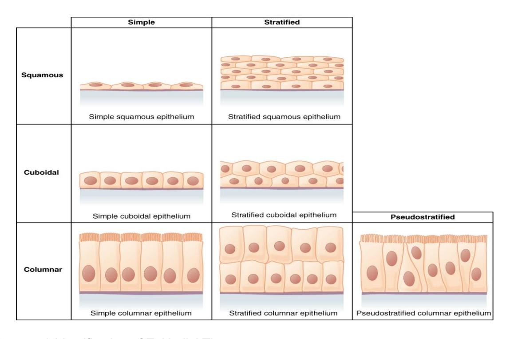
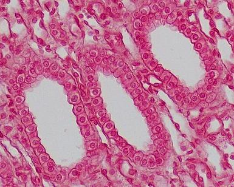
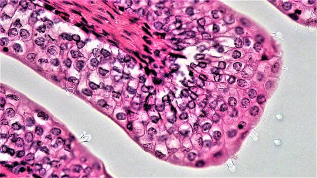
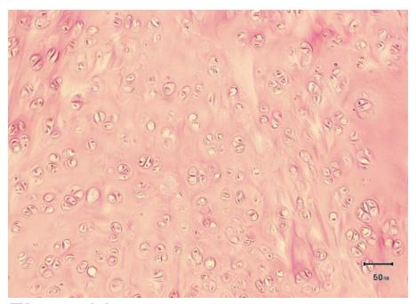
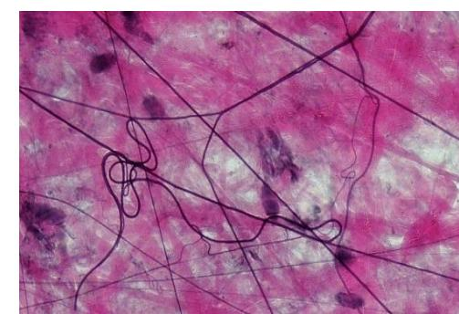
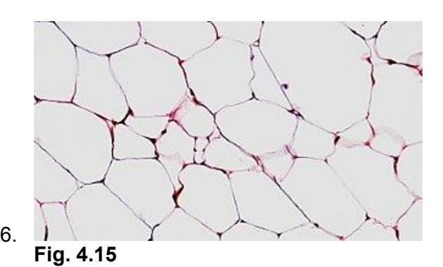
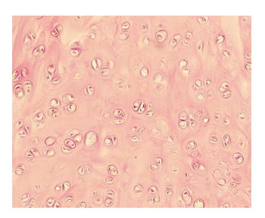
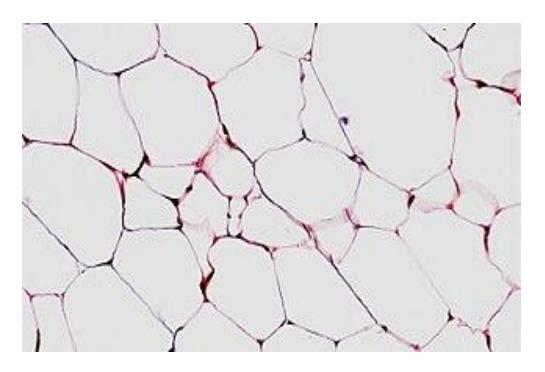

# Chapter 4: Histology / Tissues

## Prelab Activity 4.1 — Types of Tissues

| Term | Completed Definition |
|---|---|
| Epithelial | Covers body surfaces, lines cavities and organs, and forms glands. |
| Connective | Supports, binds, protects, stores energy, and transports substances. |
| Muscular | Contracts to produce movement, posture, and heat. |
| Nervous | Detects stimuli and sends electrical signals for communication and control. |

## Epithelial Tissue Terms

| Term | Completed Definition |
|---|---|
| Simple squamous | One thin layer of flat cells; allows diffusion and filtration. |
| Stratified squamous, keratinized | Many layers of cells with keratin; protects dry surfaces such as skin. |
| Stratified squamous, nonkeratinized | Many layers without keratin; protects moist surfaces such as mouth and vagina. |
| Simple cuboidal | One layer of cube-shaped cells; secretion and absorption. |
| Stratified cuboidal / columnar | Rare; usually protects and lines ducts of large glands. |
| Simple columnar | One layer of tall cells; absorption and secretion. |
| Pseudostratified columnar | One layer that looks multilayered; often has cilia and goblet cells. |
| Transitional epithelium | Stretchable epithelium; found in urinary bladder and ureters. |
| Simple | One layer of cells. |
| Stratified | More than one layer of cells. |
| Apical surface | Free surface facing a lumen or outside space. |
| Basal surface | Surface attached to the basement membrane. |
| Basement membrane | Thin layer that anchors epithelium to underlying connective tissue. |

## Connective Tissue Terms

| Term | Completed Definition |
|---|---|
| Cartilage | Firm supportive connective tissue with chondrocytes in lacunae. |
| Areolar connective tissue | Loose connective tissue that wraps and cushions organs. |
| Hyaline cartilage | Smooth cartilage supporting joints, trachea, nose, and costal cartilage. |
| Adipose tissue | Fat-storing connective tissue for insulation, protection, and energy storage. |
| Fibrocartilage | Strong cartilage with thick collagen fibers; found in discs and menisci. |
| Elastic cartilage | Flexible cartilage with elastic fibers; found in ear and epiglottis. |
| Dense regular connective tissue | Parallel collagen fibers; found in tendons and ligaments. |
| Dense irregular connective tissue | Irregular collagen fibers; resists stress in many directions. |
| Bone | Hard mineralized connective tissue for support and protection. |
| Blood | Fluid connective tissue that transports gases, nutrients, and wastes. |
| Collagen fibers | Strong fibers that resist pulling forces. |
| Elastin fibers | Stretchy fibers that allow recoil. |
| Extracellular matrix | Nonliving material surrounding cells; includes fibers and ground substance. |
| Fibroblasts | Cells that produce connective tissue fibers and matrix. |
| Adipocytes | Fat cells that store lipids. |
| Chondrocytes | Cartilage cells. |
| Lacuna | Small cavity that houses a chondrocyte or osteocyte. |

## Lab Activity 4.1 — Epithelial Tissue Identification

| Image | Name | Location | Function |
|---|---|---|---|
|  | Simple squamous epithelium | Alveoli of lungs, capillary walls, kidney glomeruli | Diffusion and filtration. |
|  | Simple cuboidal epithelium | Kidney tubules and small gland ducts | Secretion and absorption. |
|  | Simple columnar epithelium | Digestive tract lining | Absorption and secretion. |
|  | Stratified squamous epithelium | Epidermis, mouth, esophagus, vagina | Protection from abrasion. |
|  | Pseudostratified ciliated columnar epithelium | Trachea and upper respiratory tract | Secretes and moves mucus. |
|  | Transitional epithelium | Urinary bladder, ureters | Stretches and recoils. |

## Lab Activity 4.2 — Microscope Work: Epithelial Tissue

| Tissue | Magnification | Location |
|---|---:|---|
| Simple squamous | 400x | Alveoli, capillaries, kidney glomeruli |
| Simple cuboidal | 400x | Kidney tubules, ducts of small glands |
| Simple columnar | 400x | Small intestine and stomach lining |
| Transitional | 400x | Urinary bladder and ureters |
| Stratified squamous | 400x | Epidermis, mouth, esophagus, vagina |

## Lab Activity 4.3 / 4.4 — Connective Tissue Microscope Work

| Tissue | Magnification | Location |
|---|---:|---|
| Areolar | 400x | Under epithelia and around organs |
| Adipose | 400x | Hypodermis, around kidneys and eyeballs |
| Dense regular connective tissue | 400x | Tendons and ligaments |
| Blood | 400x | Blood vessels and heart |
| Hyaline cartilage | 400x | Trachea, nose, costal cartilage, articular surfaces |
| Fibrocartilage | 400x | Intervertebral discs, pubic symphysis, menisci |
| Elastic cartilage | 400x | External ear and epiglottis |
| Bone | 100x or 400x | Bones of skeleton |

## Post Lab Activity 4.1 — Test Your Understanding

| Question | Completed Answer |
|---|---|
| Two ways epithelium is classified | By number of layers and by cell shape. |
| Cell shapes | Squamous cells are flat, cuboidal cells are cube-shaped, and columnar cells are tall. |
| Simple epithelium function | Often absorption, secretion, diffusion, or filtration. |
| Stratified epithelium function | Protection from abrasion or stress. |
| Major tissue types | Epithelial, connective, muscle, and nervous tissue. |
| The blank tissue contains an apical surface | Epithelial tissue. |

## Post Lab Activity 4.2 — Identify the Figures

| Figure | Tissue Type | Location |
|---|---|---|
| Figure 4.10 | Bone / compact bone | Skeleton |
| Figure 4.11 | Hyaline cartilage | Trachea, nose, costal cartilage, articular surfaces |
| Figure 4.12 | Elastic cartilage | External ear and epiglottis |
| Figure 4.13 | Areolar connective tissue | Beneath epithelia and around organs |
| Figure 4.14 | Dense regular connective tissue | Tendons and ligaments |
| Figure 4.15 | Adipose tissue | Hypodermis and around organs |

## Post Lab Activity 4.3 — Crossword Answers

| Direction | Number | Completed Answer |
|---|---:|---|
| Across | 4 | Simple squamous epithelium |
| Across | 5 | Neuron |
| Across | 7 | Glial cell |
| Across | 9 | Stratified squamous epithelium |
| Across | 11 | Simple cuboidal epithelium |
| Across | 12 | Skeletal muscle |
| Down | 1 | Dense regular connective tissue |
| Down | 2 | Loose connective tissue |
| Down | 3 | Bone |
| Down | 6 | Hyaline cartilage |
| Down | 8 | Cardiac muscle |
| Down | 10 | Smooth muscle |

## Review Images

