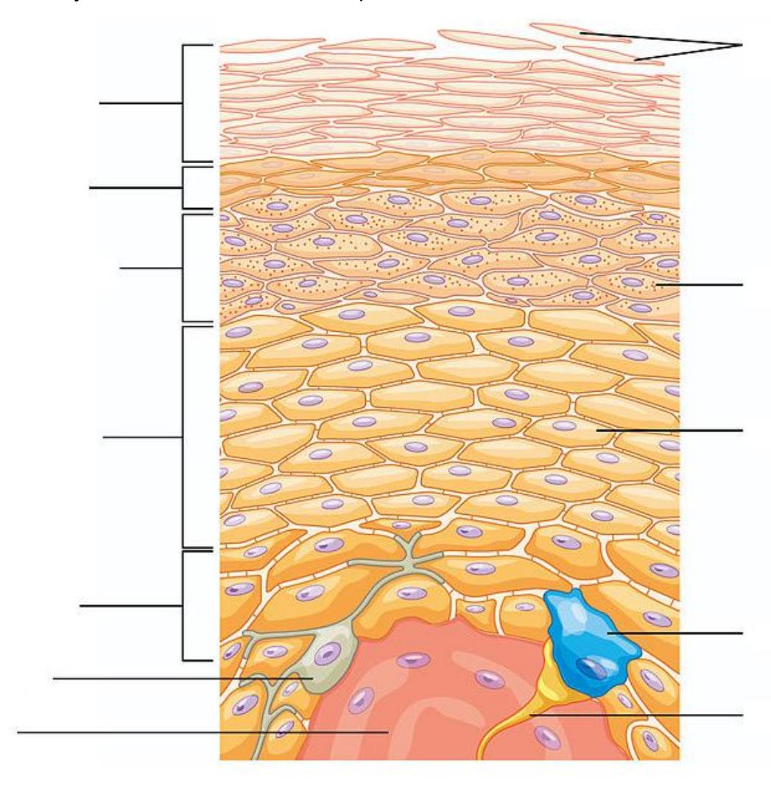
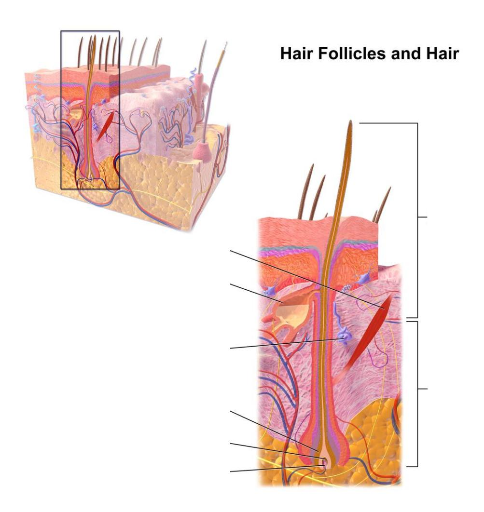

# Chapter 5: Integumentary System

## Prelab Activity 5.1 — Epidermal and Dermal Layers

| Term | Completed Definition |
|----|----|
| Epidermis | Outermost layer of skin made of keratinized stratified squamous epithelium. |
| Stratum corneum | Outermost layer of dead, flattened, keratinized cells. |
| Stratum lucidum | Clear layer found only in thick skin. |
| Stratum granulosum | Layer where keratinocytes flatten and keratinization increases. |
| Stratum spinosum | Layer of keratinocytes connected by desmosomes; helps strength and flexibility. |
| Stratum basale / germinativum | Deepest epidermal layer; mitotic cells, melanocytes, and Merkel cells are found here. |
| Dermal layer | Connective tissue layer beneath the epidermis. |
| Dermis | Layer containing blood vessels, nerves, glands, hair follicles, and connective tissue. |
| Papillary layer | Superficial dermis made mostly of areolar connective tissue; forms dermal papillae. |
| Reticular layer | Deeper dermis made mostly of dense irregular connective tissue. |
| Subcutaneous layer / hypodermis | Layer beneath dermis, mostly areolar and adipose tissue; anchors skin and stores fat. |

## Prelab Activity 5.1 — Integumentary Structures

| Term | Completed Definition |
|----|----|
| Dermal papillae | Upward projections of dermis that increase contact with epidermis. |
| Hair shaft | Part of hair above the skin surface. |
| Hair root | Part of hair below the skin surface. |
| Hair follicle | Tubelike structure surrounding the hair root. |
| Pore | Opening of a sweat gland duct at the skin surface. |
| Arrector pili muscle | Smooth muscle that pulls hair upright and causes goose bumps. |
| Sebaceous gland | Oil gland that secretes sebum to lubricate skin and hair. |
| Merocrine / eccrine sweat gland | Sweat gland for cooling and excretion; opens to skin surface. |
| Apocrine sweat gland | Sweat gland in axillary and genital regions; associated with hair follicles. |
| Free nerve ending | Sensory receptor for pain, temperature, and touch. |
| Meissner's / tactile corpuscle | Sensory receptor for light touch. |
| Pacinian / pressure corpuscle | Sensory receptor for deep pressure and vibration. |
| Keratinocyte | Main epidermal cell that produces keratin. |
| Melanocyte | Cell that produces melanin pigment. |

## Prelab Activity 5.2 — Labels

| Label | Completed Answer                 |
|------:|----------------------------------|
|     4 | Epidermis                        |
|     5 | Dermis                           |
|     6 | Hypodermis / subcutaneous layer  |
|    15 | Hair shaft                       |
|    21 | Hair follicle / hair root region |
|    14 | Sebaceous gland                  |
|    20 | Arrector pili muscle             |

## Table 5.1 — Epidermal Layers

| Epidermal Layer | Major Features |
|----|----|
| Stratum corneum | Most superficial layer; dead keratinized cells; protection and water resistance. |
| Stratum lucidum | Clear layer found only in thick skin of palms and soles. |
| Stratum granulosum | Cells flatten; keratohyalin granules appear; cells begin to die. |
| Stratum spinosum | Several layers of keratinocytes; desmosomes give a spiny appearance; strength. |
| Stratum basale / germinativum | Deepest layer; active mitosis; contains melanocytes and Merkel cells. |

## Lab Activity 5.1 — Thick and Thin Skin

| Question | Completed Answer |
|----|----|
| What differences are seen between thick and thin skin? | Thick skin has a much thicker epidermis, a thicker stratum corneum, and a visible stratum lucidum. Thin skin has hair follicles and glands and lacks stratum lucidum. |
| Where is thick skin located? | Palms of hands, fingertips, and soles of feet. |
| Where is thin skin located? | Most other body areas. |
| Function of thick skin | Extra protection against friction and pressure. |
| Function of thin skin | Flexible covering with hair, glands, sensation, and thermoregulation. |

## Table 5.2 — Epidermal Layers Superficial to Deep

| Epidermal Layer | Description |
|----|----|
| Stratum corneum | Dead, flat keratin-filled cells that form a protective waterproof barrier. |
| Stratum lucidum | Clear dead cell layer found only in thick skin. |
| Stratum granulosum | Keratinocytes contain granules and begin to break down. |
| Stratum spinosum | Living keratinocytes joined by desmosomes; gives strength. |
| Stratum basale | Deep layer of dividing cells; contains melanocytes and Merkel cells. |

## Lab Activity 5.2 — Dermis

| Dermal Layer | Connective Tissue Type | Completed Description |
|----|----|----|
| Papillary layer | Areolar connective tissue | Superficial dermal layer with dermal papillae, capillaries, and touch receptors. |
| Reticular layer | Dense irregular connective tissue | Deeper thicker layer with collagen, elastic fibers, glands, blood vessels, and hair follicles. |

## Lab Activity 5.3 and 5.4 — Dermal Structures and Functions

| Dermal Structure | Function(s) |
|----|----|
| Dermal papillae | Increase surface contact between dermis and epidermis; help nourish epidermis. |
| Pore | Opening where sweat reaches the skin surface. |
| Arrector pili muscle | Pulls hair upright and helps squeeze sebum from sebaceous glands. |
| Sebaceous gland | Produces sebum that lubricates and protects hair and skin. |
| Merocrine / eccrine sweat gland | Produces watery sweat for cooling and waste removal. |
| Apocrine sweat gland | Produces thicker secretion in axillary/genital areas; becomes active at puberty. |
| Free nerve ending | Detects pain, temperature, itch, and crude touch. |
| Meissner's corpuscle | Detects light touch. |
| Pacinian corpuscle | Detects deep pressure and vibration. |
| Keratinocyte | Produces keratin for protection and waterproofing. |
| Melanocyte | Produces melanin to protect DNA from UV radiation. |

## Skin Pigmentation

| Concept | Completed Answer |
|----|----|
| Melanin | Pigment that gives skin, hair, and eyes color and protects from UV radiation. |
| Melanocytes | Cells in the stratum basale that make melanin. |
| Carotene | Yellow-orange pigment from foods such as carrots and sweet potatoes. |
| Hemoglobin | Blood pigment that can affect skin color depending on oxygenation and blood flow. |

## Post Lab Activity 5.1 — Concept Questions

| Question | Completed Answer |
|----|----|
| What are the three protective functions of the integumentary system? | Protection from mechanical injury, protection from pathogens/chemicals, and prevention of water loss / UV damage. |
| How does skin help regulate temperature? | Sweat glands release sweat for evaporative cooling; dermal blood vessels dilate to release heat and constrict to conserve heat. |
| What does vitamin D synthesis require? | UV light exposure helps skin begin vitamin D production. |
| Why is skin an important sensory organ? | It contains receptors for touch, pressure, pain, temperature, and vibration. |

## Post Lab Activity 5.2 — Matching

| Term | Completed Match / Definition |
|----|----|
| Epidermis | Outermost layer of the skin. |
| Dermis | Connective tissue layer containing vessels, nerves, glands, and follicles. |
| Hypodermis | Subcutaneous layer beneath dermis. |
| Stratum corneum | Dead keratinized outer layer. |
| Stratum lucidum | Clear layer in thick skin only. |
| Stratum granulosum | Granular layer where keratinization occurs. |
| Stratum spinosum | Spiny layer with strong desmosome connections. |
| Stratum basale | Deep dividing layer with melanocytes. |
| Melanocytes | Produce melanin in the stratum basale. |
| Keratinocytes | Produce keratin. |

## Table 5.6 — Match the Statement with the Best Answer

| Completed Answer | Statement |
|----|----|
| Stratum basale | Melanocytes are located in this layer. |
| Stratum corneum | The outermost layer of flattened dead cells. |
| Stratum lucidum | Clear layer found only in thick skin. |
| Stratum granulosum | Layer where keratinocytes accumulate granules. |
| Stratum spinosum | Layer with polyhedral keratinocytes and many desmosomes. |
| Dermis | Layer below the epidermis containing blood vessels and glands. |
| Hypodermis | Subcutaneous layer with adipose tissue. |

## Post Lab Activity 5.3 — Crossword Answers

| Direction | Number | Completed Answer   |
|-----------|-------:|--------------------|
| Across    |      7 | Reticular layer    |
| Across    |      8 | Stratum granulosum |
| Across    |      9 | Epidermis          |
| Down      |      1 | Stratum corneum    |
| Down      |      2 | Papillary layer    |
| Down      |      3 | Hypodermis         |
| Down      |      4 | Stratum spinosum   |
| Down      |      5 | Stratum basale     |
| Down      |      6 | Stratum lucidum    |

## Post Lab Activity 5.4 — Check Your Understanding

| Question | Completed Answer |
|----|----|
| Bullet retrieval: layers cut from superficial to deep | Epidermis, dermis, hypodermis/subcutaneous tissue, then deeper fascia/muscle or body wall tissues depending on the path to the abdomen near the spine. |
| Why is the GP not concerned about the baby's yellow-orange skin? | The likely cause is carotenemia from eating many carotene-rich foods such as carrots, sweet potatoes, squash, spinach, and cantaloupe. It is usually harmless and improves when the diet is varied. |
| How does skin regulate body temperature when temperature rises? | Sweat glands produce sweat, sweat evaporates and cools the body, and dermal blood vessels dilate to release heat. |
| Why are light-skinned individuals more susceptible to malignant melanoma? | They have less melanin protection against UV radiation, so UV can damage DNA in skin cells more easily. |

## Post Lab Activity 5.5 — Labeling Review

| Epidermal Layer | Completed Label                  |
|-----------------|----------------------------------|
| 1               | Stratum corneum                  |
| 2               | Stratum lucidum, thick skin only |
| 3               | Stratum granulosum               |
| 4               | Stratum spinosum                 |
| 5               | Stratum basale                   |

| Accessory Structure  | Completed Identification                          |
|----------------------|---------------------------------------------------|
| Hair shaft           | Part of hair above skin surface.                  |
| Hair root            | Part of hair below skin surface.                  |
| Hair bulb            | Enlarged base of hair root.                       |
| Hair follicle        | Tube around the hair root.                        |
| Arrector pili muscle | Smooth muscle attached to follicle.               |
| Sebaceous gland      | Oil gland opening into follicle.                  |
| Apocrine sweat gland | Large sweat gland associated with hair follicles. |

## Post Lab Activity 5.6 — Fill in the Blanks

| Question | Completed Answer |
|----|----|
| Name the layers of the dermis. | Papillary layer and reticular layer. |
| The skin is composed of what type of epithelial tissue? | Keratinized stratified squamous epithelium. |

| Major Glands | Function |
|----|----|
| Sebaceous gland | Produces sebum to lubricate skin and hair. |
| Eccrine / merocrine sweat gland | Produces watery sweat for cooling. |
| Apocrine sweat gland | Produces thicker sweat associated with hair follicles in axillary/genital areas. |

| Three Protective Functions | Completed Answer |
|----|----|
| a | Protects against physical trauma and abrasion. |
| b | Prevents water loss and blocks many chemicals/pathogens. |
| c | Protects against UV damage with melanin. |

| Four Functions of the Integumentary System | Completed Answer        |
|--------------------------------------------|-------------------------|
| a                                          | Protection.             |
| b                                          | Temperature regulation. |
| c                                          | Sensation.              |
| d                                          | Vitamin D synthesis.    |

| Five Layers of Thick Skin | Present in Thin Skin?     |
|---------------------------|---------------------------|
| Stratum corneum           | Present.                  |
| Stratum lucidum           | Not present in thin skin. |
| Stratum granulosum        | Present.                  |
| Stratum spinosum          | Present.                  |
| Stratum basale            | Present.                  |

| Four Accessory Structures in the Dermis | Function |
|----|----|
| Hair follicle | Produces and surrounds hair root. |
| Sebaceous gland | Produces oil/sebum. |
| Sweat gland | Produces sweat. |
| Arrector pili muscle | Raises hair and causes goose bumps. |
